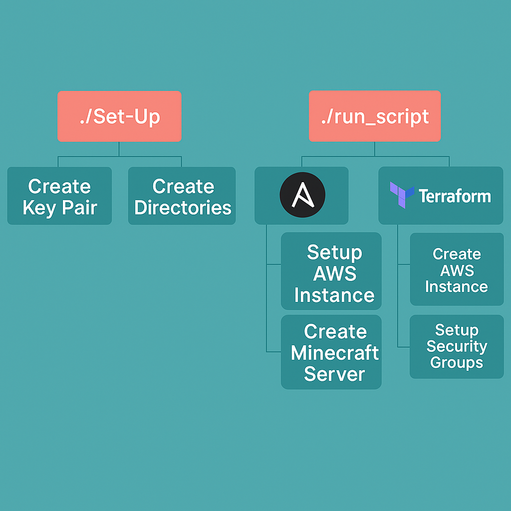

# 🧱 Minecraft Server on AWS using Terraform, Ansible, and Docker

This project provisions and configures a Minecraft server on AWS using **Terraform** for infrastructure, **Ansible** for provisioning, and **Docker** to run the server.

---

## 📦 Prerequisites

Before starting, ensure the following tools are installed on your system:

- [Terraform](https://developer.hashicorp.com/terraform/tutorials/aws-get-started/install-cli)
- [AWS CLI](https://docs.aws.amazon.com/cli/latest/userguide/getting-started-install.html)
- [Ansible](https://ansible.readthedocs.io/projects/ansible-core/devel/installation_guide/index.html)

---

## Diagram



## 🚀 Getting Started

### 1. Clone the Repository

```bash
git clone git@github.com:vibrahim09/terraform_minecraft_server.git
cd terraform_minecraft_server
```

> 🔑 If you’re not using SSH, use the HTTPS clone URL instead.

---

### 2. Make Setup Scripts Executable

```bash
chmod +x ./set_up.bash
chmod +x ./run_script.bash
```

---

### 3. Run Initial Setup

This creates required directories and initializes configuration files:

```bash
./set_up.bash
```

After running this script:

- Navigate to the `.aws/` directory.
- Add your AWS credentials to a file named `credentials`.

---

### 4. Create Terraform Variables File

Create a file named `terraform.tfvars` and populate it with your infrastructure values:

```bash
touch terraform.tfvars
```

```hcl
vpc_id        = "vpc-xxxxxxxxxxxxxxxxx"     # Replace with your VPC ID
subnet_id     = "subnet-xxxxxxxxxxxxxxx"    # Replace with your Subnet ID
ami_id        = "ami-xxxxxxxxxxxxxxxxx"     # Replace with a valid AMI ID
key_name      = "minecraft_project_2"       # Use your SSH key name
instance_type = "t2.medium"                 # t2.medium recommended
instance_name = "minecraft-instance"        # Your desired instance name
```

These should match the variable names defined in `variables.tf`.

---

### 5. Deploy the Server

With the `.tfvars` file set up, run:

```bash
./run_script.bash
```

This script runs Terraform to deploy your EC2 instance and Ansible to configure it.

---

## 🧪 Testing the Deployment

Once you see the success message, test the Minecraft port (default 25565) to ensure it's open:

```bash
nmap -sV -Pn -p 25565 <instance_public_ip>
```

If port 25565 is reported as open and running a service, your server is likely working!

---

## 📌 Notes

- Ensure your AWS security group allows inbound traffic on port 25565.
- Your `.aws/credentials` file should be properly configured before running any Terraform or Ansible commands.

---

## 👤 Author

**Ibrahim Velasquez**  
GitHub: [@vibrahim09](https://github.com/vibrahim09)
